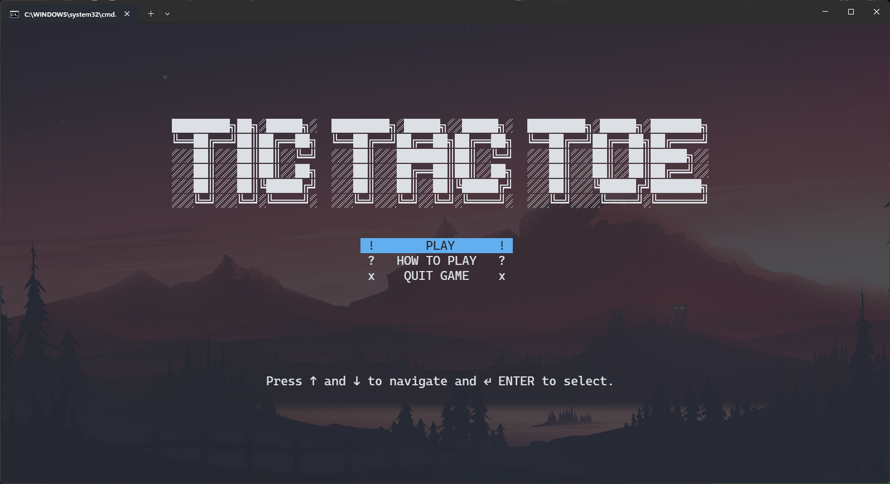

# Tic Tac Toe



```
TicTacToe
│   Game.cs									|> Mengatur UI pada game tic tac toe
│   Printer.cs							|> Utilitas untuk menampilkan output (center screen dll)
│   Program.cs							|> Program utama
│   TicTacToe.cs						|> Logika game tic tac toe
│
├───Pages										|> Semua halaman pada game
│       HelpPage.cs					|> Halaman bantuan 										(exdends Page)
│       InGamePage.cs				|> Halaman game												(exdends Page)
│       MainMenuPage.cs			|> Halaman menu utama									(exdends Page)
│       Page.cs							|> Class dasar untuk semua halaman
|
```
